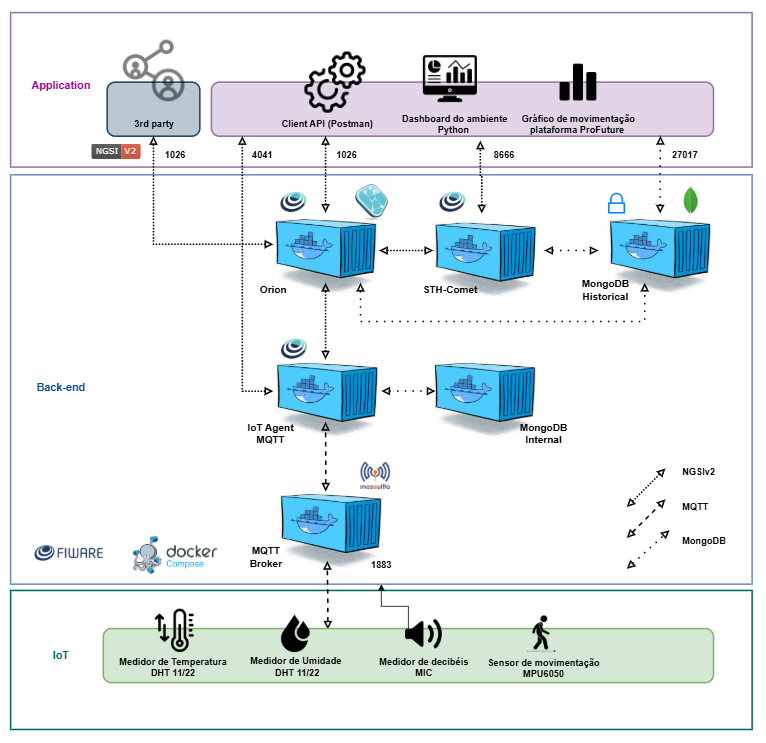
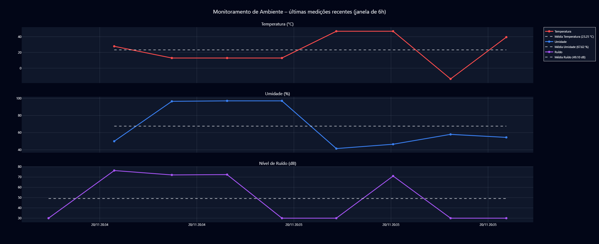
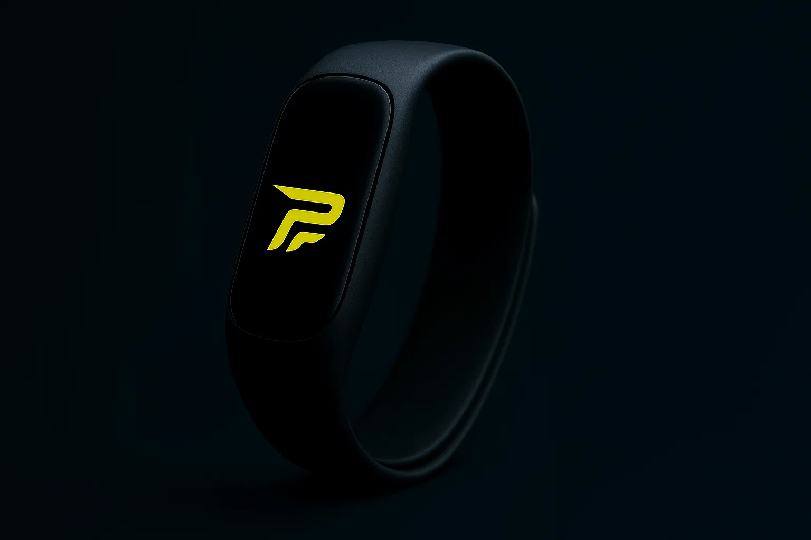
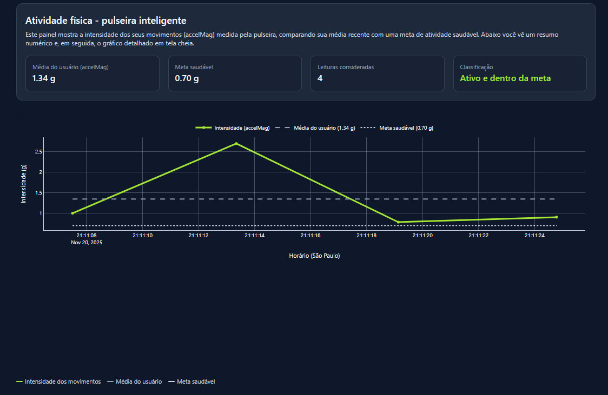

# Monitoramento_Ambiente-HomeOffice_FIWARE  
Projeto de monitoramento de **temperatura, umidade, ruído** e **atividade física** para avaliar a qualidade do ambiente de trabalho em home office.

---

## 📖 Descrição Geral

Este projeto integra **IoT + FIWARE + Postman + Python** para criar uma solução de monitoramento focada em **saúde, conforto e bem-estar de colaboradores em home office**.

Ele é composto por **dois sensores principais**, tratados em tópicos separados:

1. 🏠 **Sensor de Ambiente (Env001)**  
   Mede **temperatura (°C)**, **umidade relativa (%)** e **nível de ruído (dB)** no ambiente de trabalho.

2. ⌚ **Sensor de Movimento – Pulseira Inteligente (Bracelet001)**  
   Analisa a **movimentação do usuário** (passos, aceleração, estado de atividade) para identificar se ele está **ativo ou sedentário**.

Os dados de ambos são enviados via **MQTT** para o **IoT Agent FIWARE**, armazenados no **STH-Comet** e podem ser visualizados via **Postman** e **dashboards em Python**.

---

## 🔗 Links Importantes

- 🌡️ **Simulação do Sensor de Ambiente (Env001) – Wokwi**  
  <a href="https://wokwi.com/projects/447831587735764993">Clique aqui</a>

- ⌚ **Simulação da Pulseira Inteligente (Bracelet001) – Wokwi**  
  <a href="https://wokwi.com/projects/447831514509488129">Clique aqui</a>

- 🌐 **Plataforma ProFuture (integração da pulseira com o site e gráfico da pulseira)**  
  👉 O **gráfico da pulseira inteligente** é executado **dentro deste projeto**, não neste repositório.  
  <a href="https://github.com/EnzoRamos0108/GS-ProFuture">Clique aqui</a>

- Video no Youtube do projeto
  <a href="https://www.youtube.com/watch?v=-JVx-59RoN0">Clique aqui</a>

- 📬 **Collection Postman (provisionamento FIWARE)**  
  Arquivo `Postman.json` enviado junto ao projeto (importar no Postman).

---

## 🧱 Arquitetura Geral

Fluxo simplificado do projeto:

# 🏠 1. Sensor de Ambiente (Env001)
## 1.1 Objetivo

O sensor de ambiente tem como objetivo monitorar as condições do ambiente de home office do colaborador, permitindo que empresas acompanhem:

- 🌡️ Temperatura do local de trabalho

- 💧 Umidade relativa do ar

- 🔊 Nível de ruído (decibéis)

Com esses dados, é possível:

- Identificar ambientes desconfortáveis ou inadequados

- Correlacionar condições ruins com queda de produtividade

- Apoiar ações de melhoria de ergonomia e bem-estar

## 1.2 Simulação no Wokwi

Simulação do sensor de ambiente:

👉 <a href="https://wokwi.com/projects/447831587735764993">Projeto Wokwi – Sensor de Ambiente</a>

No código do ESP32:

O dispositivo envia periodicamente os valores de:

- 🌡️ temperature

- 💧 humidity

- 🔊 noiseLevel

Os dados são publicados via MQTT com:

-device_id (por exemplo: env001)

-apikey configurada no IoT Agent

-service smart e servicePath /

## 1.3 Provisionamento via Postman (Env001)

Use o Postman.json enviado junto ao projeto e importe no Postman.

Fluxo típico para o sensor de ambiente:

1. Health check do IoT Agent

2. Provisionar Service Group para MQTT (apikey, serviço, servicePath)

3. Provisionar o dispositivo de ambiente (Env001)

4. Listar dispositivos para confirmar cadastro

5. Criar subscriptions no Orion para envio de histórico ao STH-Comet

6. Consultar o histórico no STH-Comet (atributos: temperature, humidity, noiseLevel)

Toda a configuração detalhada (URLs, headers, JSON de provisionamento) já está no Postman.json.

## 1.4 Monitoramento com Python – Gráficos de Ambiente (Google Colab)

⚠️ Importante:
📌 O código Python que acompanha este projeto foi feito para ser executado diretamente no Google Colab. Voce pode ver ele nas pastas ao lado.

Ele faz:

Criação de 3 gráficos interativos com o Plotly:

- Temperatura (°C)

- Umidade (%)

- Nível de ruído (dB)

- Linha de média em cada gráfico

### 1.4.1 Como rodar o código no Google Colab

-Acesse o Google Colab: https://colab.research.google.com

-Crie um Novo notebook

-Cole o codigo e rode

-Localize a parte de configuração e ajuste o IP

Ao final, o comando fig.show() exibirá uma figura interativa com 3 gráficos.

## 📊 Exemplo de Dashboard de Ambiente

# ⌚ 2. Sensor de Movimento – Pulseira Inteligente (Bracelet001)

## 2.1 Objetivo

A pulseira inteligente monitora a movimentação do usuário para verificar se ele está:

- Muito tempo sentado (comportamento sedentário)

- Realizando pausas ativas e se movimentando ao longo do dia

Isso é essencial para:

- Prevenir problemas de saúde relacionados ao sedentarismo

- Incentivar pausas durante o trabalho remoto

- Integrar métricas de bem-estar na plataforma corporativa (ex.: ProFuture)

A pulseira pode enviar, por exemplo:

- accelMag – magnitude da aceleração (força do movimento)

- steps – contagem de passos

- state – estado do usuário (ativo, parado, etc.)

## 2.2 Simulação no Wokwi

Simulação da pulseira:

👉 <a href="https://wokwi.com/projects/447831514509488129">Projeto Wokwi – Pulseira Inteligente</a>

No código da pulseira (ESP32):

-O dispositivo lê dados de aceleração/movimento

Publica via MQTT os atributos como:

-accelMag

-steps

-state

Respeitando o device_id (ex.: brace001) e apikey configurados no IoT Agent.

## 2.3 Provisionamento via Postman (Bracelet001)

Usando o mesmo Postman.json:

1. Verificar o Service Group já existente (o mesmo usado no sensor de ambiente).

2. Executar a requisição de provisionamento da pulseira (brace001) na collection.

3. Confirmar na requisição de listar devices que a pulseira está cadastrada.

4. Criar/Confirmar subscriptions para enviar mudanças da entidade da pulseira ao STH-Comet.

5. Consultar o histórico dos atributos accelMag, steps e state no STH-Comet.

Assim, você consegue enxergar:

- Se o usuário ficou ativo por longos períodos

- Se passou muito tempo parado

- Quantos passos foram dados em determinado intervalo de tempo

## 2.4 Gráfico da Pulseira – Execução no Projeto ProFuture

📌 Importante:
O gráfico da pulseira inteligente não é executado neste repositório.
Ele faz parte do projeto ProFuture (GS-ProFuture).

Para visualizar e executar o gráfico da pulseira:

Acesse o repositório ProFuture:
👉 <a href="https://github.com/EnzoRamos0108/GS-ProFuture">GS-ProFuture</a>

## 📊 Exemplo de Dashboard da Pulseira

Siga as instruções desse projeto (frontend + backend) para:

- Consumir os dados enviados pela pulseira

- Exibir o gráfico de atividade / minutos ativos / movimento do usuário

- Toda a lógica de exibição do gráfico da pulseira está implementada dentro do ProFuture, integrada com a aplicação Web.

Ou seja:

Este repositório foca no fluxo FIWARE + monitoramento de ambiente + documentação geral.

O repositório ProFuture é o responsável por mostrar a parte visual/gráfico da pulseira no contexto da plataforma de vagas e desenvolvimento profissional.

# 👨‍💻 Integrantes do Grupo

| Nome | RM |
| :----------- | :------- |
| Enzo Fernandes Ramos    | 563705    | 
| Felipe Henrique de Souza Cerazi        | 562746 | 
| Gustavo Peaguda de Castro     | 562923 | 

